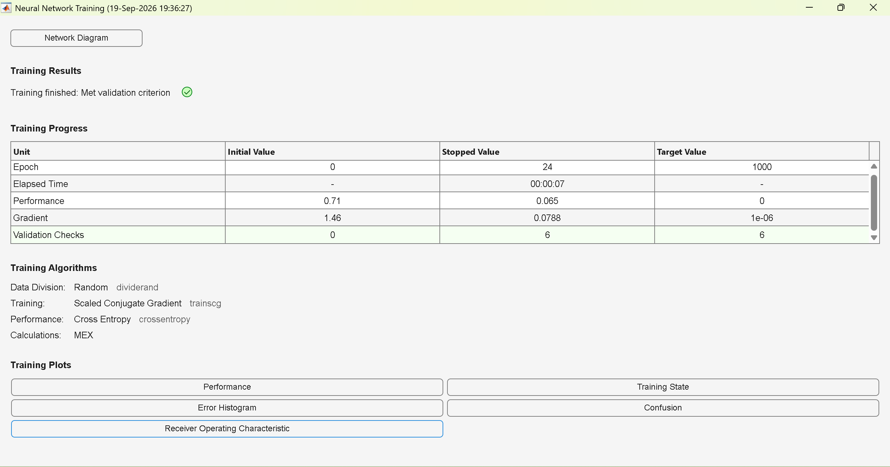
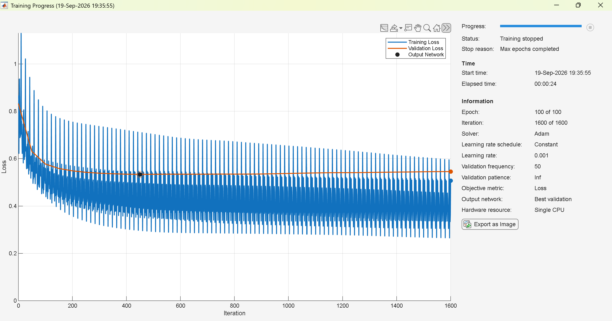
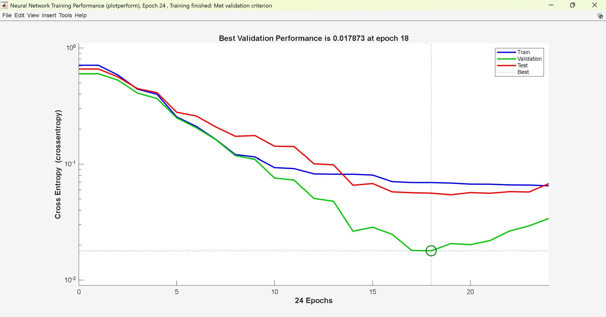
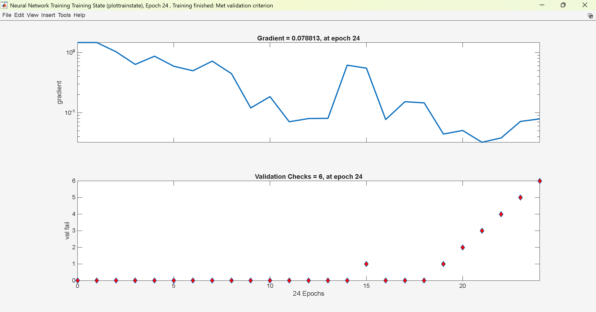
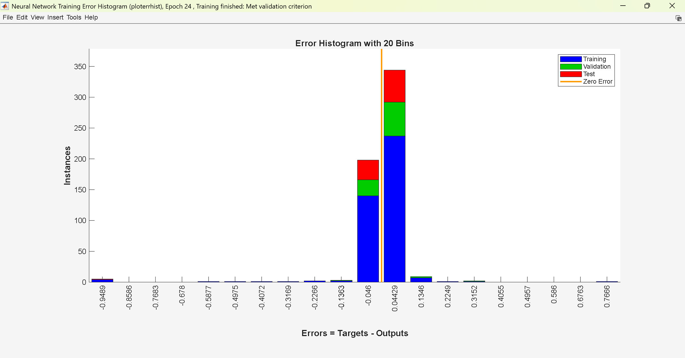
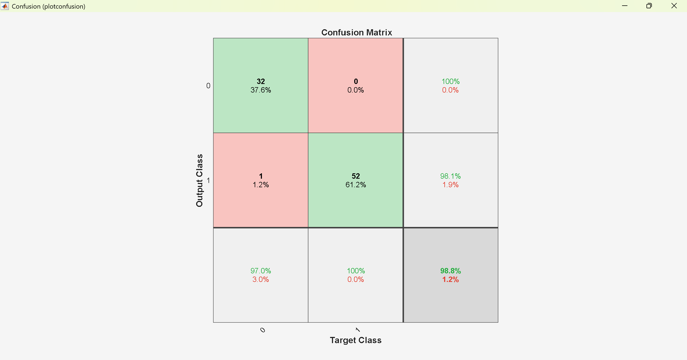
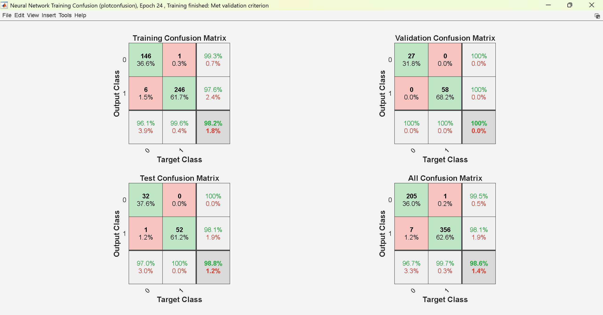
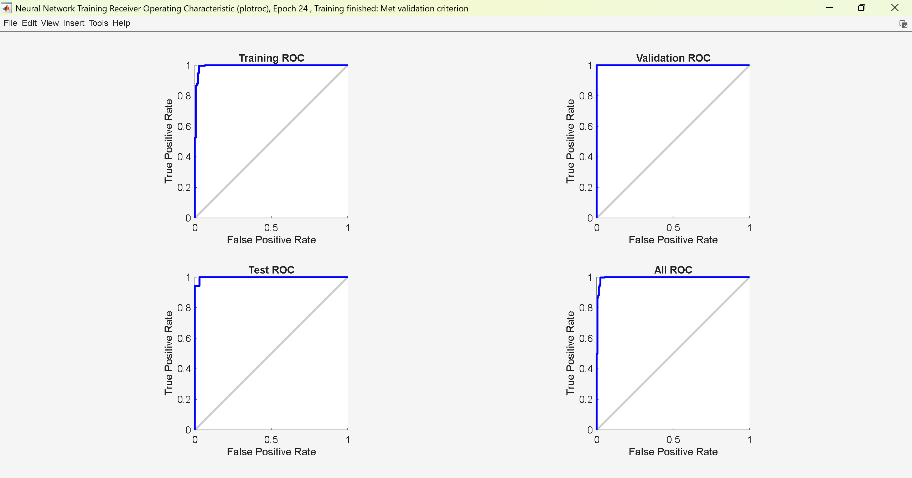
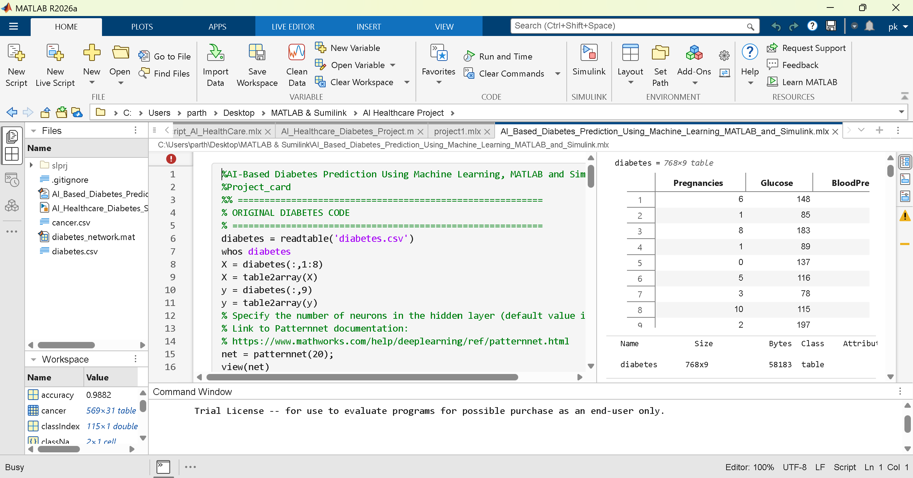
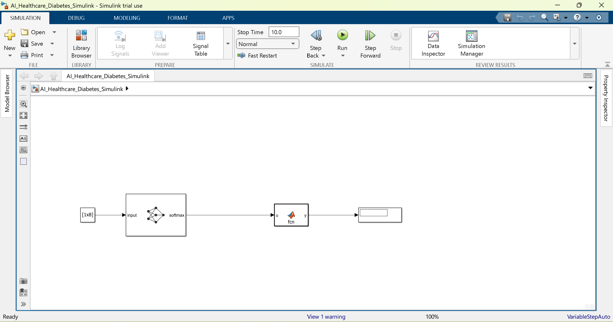

# AI-Based Diabetes Prediction Using Machine Learning, MATLAB and Simulink


## 📌 Project Overview

This project presents an AI-based healthcare system for predicting diabetes using Machine Learning, MATLAB, and Simulink.

The project demonstrates the complete workflow of developing a neural-network-based classification model, including data loading, preprocessing, model training, validation, testing, performance evaluation, new patient prediction, saving the trained model, and integrating the trained model with Simulink.

A cancer dataset is also included as a secondary demonstration of neural-network classification using MATLAB.

## 🎯 Project Objective

The main objective of this project is:

> To build, train, test, and simulate a neural-network-based machine learning classifier for predicting diabetes in patients using MATLAB and Simulink.

## 🛠️ Technologies Used

- MATLAB R2026a
- Simulink 26.1
- Deep Learning
- Machine Learning
- Neural Networks
- Classification
- Data Visualization

## 📊 Diabetes Dataset

The diabetes dataset contains 768 patient records with 8 input features and 1 target variable.

### Input Features

| Feature | Description |
|---|---|
| Pregnancies | Number of pregnancies |
| Glucose | Plasma glucose concentration |
| BloodPressure | Diastolic blood pressure |
| SkinThickness | Triceps skin-fold thickness |
| Insulin | 2-Hour serum insulin |
| BMI | Body Mass Index |
| DiabetesPedigreeFunction | Diabetes pedigree function |
| Age | Patient age |

### Target Variable

- `0` → No Diabetes
- `1` → Diabetes

Dataset file:

`diabetes.csv`

## 🧠 Neural Network Architecture

The diabetes prediction model uses the following neural network architecture:

Input Layer  
↓  
8 Input Features  
↓  
Fully Connected Layer – 20 Neurons  
↓  
ReLU Activation  
↓  
Fully Connected Layer – 2 Neurons  
↓  
Softmax  
↓  
No Diabetes / Diabetes

The input features are normalized using z-score normalization.

## 🔄 Training, Validation and Testing

The diabetes dataset is divided into:

- 70% Training
- 15% Validation
- 15% Testing

The model is trained using the Adam optimizer.

### Training Parameters

| Parameter | Value |
|---|---|
| Maximum Epochs | 100 |
| Mini-Batch Size | 32 |
| Initial Learning Rate | 0.001 |
| Optimizer | Adam |
| Normalization | Z-score |

# 📈 Model Results and Performance

## Neural Network Architecture



## Training Progress



## Training Performance



## Training State



## Error Histogram



## Confusion Matrix



## Training Confusion



## ROC Curve



# 💻 MATLAB Implementation

The complete MATLAB implementation is provided in:

`AI_Based_Diabetes_Prediction_Using_Machine_Learning_MATLAB_and_Simulink.mlx`

The MATLAB implementation includes:

1. Loading the diabetes dataset
2. Preparing input and target data
3. Creating the neural network
4. Training the model
5. Validation and testing
6. Accuracy calculation
7. Confusion matrix generation
8. New patient prediction
9. Cancer classification demonstration
10. Saving the trained diabetes network for Simulink

### MATLAB Code



# 🔄 Simulink Implementation

The trained diabetes neural network is integrated into Simulink for patient prediction.

The Simulink workflow is:

Patient Input  
↓  
Constant Block  
↓  
Predict Block  
↓  
MATLAB Function  
↓  
Display  
↓  
Final Prediction

The Simulink model is:

`AI_Healthcare_Diabetes_Simulink.slx`

The trained neural network is saved as:

`diabetes_network.mat`

## Simulink Model



# 🧪 Example Patient Prediction

An example patient input used for testing is:

`[2 120 70 25 80 28.5 0.5 35]`

The input represents:

| Parameter | Value |
|---|---:|
| Pregnancies | 2 |
| Glucose | 120 |
| Blood Pressure | 70 |
| Skin Thickness | 25 |
| Insulin | 80 |
| BMI | 28.5 |
| Diabetes Pedigree Function | 0.5 |
| Age | 35 |

The model generates prediction scores for:

- No Diabetes
- Diabetes

The Simulink MATLAB Function converts the prediction into:

- `0` → No Diabetes
- `1` → Diabetes

# 📁 Project Structure

```text
AI Healthcare Project/
│
├── AI_Based_Diabetes_Prediction_Using_Machine_Learning_MATLAB_and_Simulink.mlx
├── AI_Healthcare_Diabetes_Simulink.slx
├── diabetes.csv
├── cancer.csv
├── diabetes_network.mat
│
└── screenshots/
    ├── confusion_matrix.png
    ├── neural_network_architecture.png
    ├── training_progress.png
    ├── training_performance.png
    ├── training_state.png
    ├── error_histogram.png
    ├── training_confusion.png
    ├── roc_curve.png
    ├── matlab_code.png
    └── simulink_model.png
🔬 Cancer Classification Demonstration

The project also includes a cancer dataset:

cancer.csv

The cancer section demonstrates how neural networks can be applied to another healthcare classification problem.

It includes:

Dataset loading
Feature extraction
Data visualization
Neural network creation
Model training
Test prediction
Accuracy calculation
Confusion matrix
📸 Screenshots

All major MATLAB and Simulink outputs are available in the screenshots folder.

The screenshots include:

Neural network architecture
Training progress
Training performance
Training state
Error histogram
Confusion matrix
Training confusion
ROC curve
MATLAB code
Simulink model
📌 Key Features
AI-based diabetes prediction
Neural-network classification
MATLAB implementation
Simulink implementation
Training, validation and testing
Model performance evaluation
Confusion matrix
ROC analysis
New patient prediction
Saved trained model
Healthcare classification demonstration
Cancer classification example
🚀 Future Improvements

Possible future improvements include:

Using larger and more diverse healthcare datasets
Feature selection
Hyperparameter optimization
Comparing multiple machine-learning algorithms
Improving model validation
Developing a graphical user interface
Deploying the model as a web or mobile application
Integrating additional patient data
Improving Simulink visualization
Adding additional healthcare prediction models
⚠️ Disclaimer

This project is developed for academic and educational purposes to demonstrate machine learning, neural networks, MATLAB, and Simulink.

The predictions generated by this model are not intended to be used as a medical diagnosis and should not replace professional medical advice, examination, or treatment.

👨‍💻 Project Information

Project Title:
AI-Based Diabetes Prediction Using Machine Learning, MATLAB and Simulink

Domain:
Artificial Intelligence / Machine Learning / Healthcare

Tools:
MATLAB and Simulink

Model:
Neural Network Classifier

Developed By:
PARTH KONDE

Institution:
SavitriBai Pune UNIVERSITY

Department:
Mechatronics Engineering

Academic Year:
2026

⭐ Project Summary

This project demonstrates the application of artificial intelligence and neural networks to healthcare data for diabetes classification.

MATLAB is used for data processing, neural-network development, training, testing, and performance evaluation. Simulink is used to demonstrate the integration and simulation of the trained diabetes prediction model.

The overall workflow is:

Data
↓
Machine Learning
↓
Neural Network
↓
Training
↓
Testing
↓
Performance Evaluation
↓
MATLAB
↓
Simulink
↓
Patient Prediction

Thank you for visiting this project!
